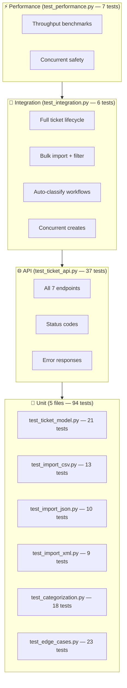

# Testing Guide

> Related: [../../README.md](../../README.md) · [../PLAN.md](PLAN.md) · [api/README.md](api/README.md)

**Coverage:** 98% · **Tests:** 144 · **Runner:** pytest 8.x

---

## Test Pyramid



---

## Quick Start

```bash
# From the homework-2/ directory

# Install test dependencies (included in requirements.txt)
pip install -r requirements.txt

# Run all tests
pytest tests/

# Run with coverage report
pytest tests/ --cov=src --cov-report=term-missing

# Run a specific file
pytest tests/test_categorization.py -v

# Run a specific test
pytest tests/test_ticket_api.py::test_create_ticket_auto_classify_flag -v
```

---

## Coverage Report

```
Name                               Stmts   Miss  Cover
------------------------------------------------------
src/models/ticket.py                 148      2    99%
src/services/classify_service.py      39      0   100%
src/services/ticket_service.py        56      0   100%
src/services/import_service.py       114      5    96%
src/routers/tickets.py                57      1    98%
src/storage/ticket_store.py           37      0   100%
src/main.py                           14      1    93%
------------------------------------------------------
TOTAL                                473      9    98%
```

HTML report: `docs/screenshots/coverage_html/index.html`

---

## Test Files

| File | Tests | What it covers |
|------|-------|----------------|
| `test_ticket_api.py` | 37 | All HTTP endpoints, status codes, filters, auto-classify |
| `test_ticket_model.py` | 21 | Pydantic validators, enums, defaults |
| `test_import_csv.py` | 13 | CSV parsing, normalization, BOM, error rows |
| `test_import_json.py` | 10 | JSON array/envelope format, errors |
| `test_import_xml.py` | 9 | XML parsing, tag arrays, nested metadata |
| `test_categorization.py` | 18 | Keyword scoring, confidence, edge cases |
| `test_integration.py` | 6 | End-to-end lifecycle, concurrent safety |
| `test_performance.py` | 7 | Time budgets, throughput |
| `test_edge_cases.py` | 23 | Uncovered paths, Unicode errors, duplicate store |

---

## Fixtures

Located in `tests/fixtures/`:

| File | Description |
|------|-------------|
| `valid_tickets.csv` | 5 valid CSV rows covering all categories |
| `invalid_tickets.csv` | 4 rows with bad email, missing fields, invalid enums |
| `valid_tickets.json` | 3 tickets in `{"tickets": [...]}` envelope |
| `invalid_tickets.json` | 2 rows with blank customer_id and bad email |
| `valid_tickets.xml` | 3 tickets with nested metadata and tag arrays |

Shared Python fixtures are in `tests/conftest.py`:
- `reset_store` (autouse) — clears in-memory store before each test
- `client` — FastAPI `TestClient`
- `sample_ticket` — valid `TicketCreate` payload dict
- `created_ticket` — pre-created ticket (for GET/PUT/DELETE tests)

---

## Running Individual Test Groups

```bash
# Unit tests only (fast, no server needed)
pytest tests/test_ticket_model.py tests/test_import_csv.py \
       tests/test_import_json.py tests/test_import_xml.py \
       tests/test_categorization.py -v

# API endpoint tests
pytest tests/test_ticket_api.py -v

# Integration tests
pytest tests/test_integration.py -v

# Performance benchmarks
pytest tests/test_performance.py -v
```

---

## Manual Testing Checklist

Before shipping a change, verify these manually via cURL or `http://localhost:8000/docs`:

- [ ] `POST /tickets` → 201 with UUID and timestamps
- [ ] `POST /tickets` with invalid email → 422 with field-level detail
- [ ] `POST /tickets` with `auto_classify: true` → classification stored, category updated
- [ ] `POST /tickets/import` with `demo/sample_tickets.csv` → 201, 15/15
- [ ] `POST /tickets/import` with `demo/sample_tickets.json` → 201, 7/7
- [ ] `POST /tickets/import` with `demo/sample_tickets.xml` → 201, 7/7
- [ ] `GET /tickets?priority=urgent&status=new` → only matching tickets
- [ ] `PUT /tickets/:id` with `status=resolved` → `resolved_at` stamped
- [ ] `DELETE /tickets/:id` → 204, then GET → 404
- [ ] `POST /tickets/:id/auto-classify` → classification field set
- [ ] Upload `.txt` file → 415 Unsupported Media Type

---

## Performance Benchmarks

Measured on a MacBook Pro M2, Python 3.11, in-memory store:

| Operation | Limit | Typical |
|-----------|-------|---------|
| Single ticket create | 100 ms | ~2 ms |
| Single ticket GET | 50 ms | ~1 ms |
| List 100 tickets | 200 ms | ~5 ms |
| CSV import (5 rows) | 300 ms | ~15 ms |
| classify() call | 50 ms | ~1 ms |
| 20 sequential creates | 1,000 ms | ~40 ms |

---

## Adding New Tests

1. Place the test file in `tests/` with name `test_*.py`
2. Import fixtures from `conftest.py` via function parameters — no manual setup needed
3. The `reset_store` fixture runs automatically — each test starts with an empty store
4. For import tests: use the service functions directly (faster than HTTP)
5. For endpoint tests: use the `client` fixture
6. Run `pytest tests/ --cov=src --cov-report=term-missing` to check coverage didn't drop

---

*For architecture context, see [architecture/README.md](architecture/README.md).*  
*For API details, see [api/README.md](api/README.md).*
