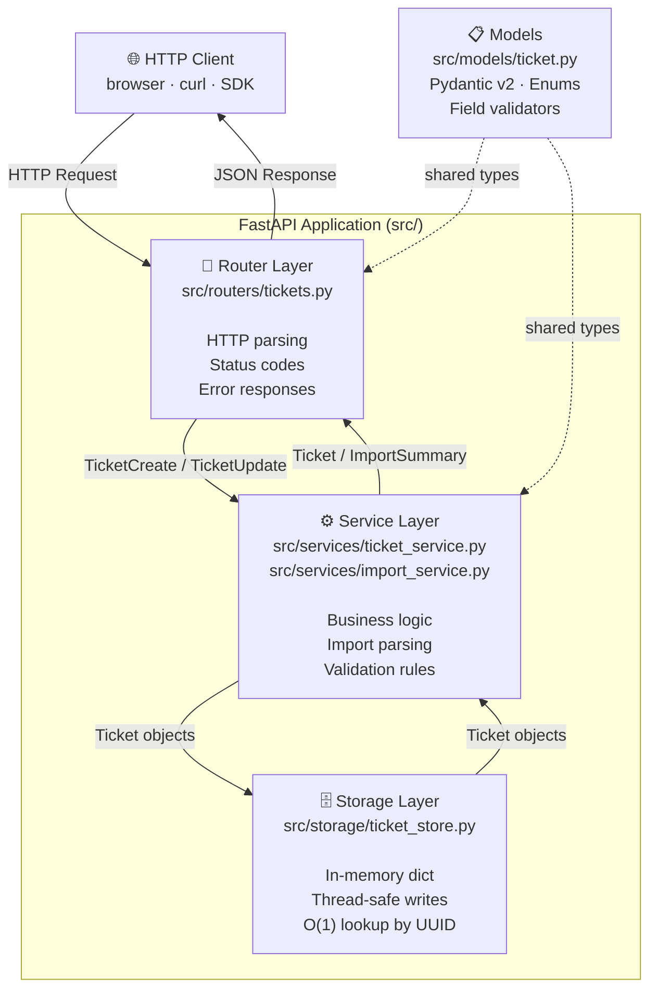

# Architecture Overview

> Related: [../../README.md](../../README.md) · [../api/README.md](../api/README.md) · [../PLAN.md](../PLAN.md)

---

## System Architecture

The application follows a strict **three-layer architecture**. Each layer has a single responsibility and communicates only with the layer directly below it.

---

## Layer Responsibilities

### Router (`src/routers/tickets.py`)
- Parses incoming HTTP requests (path params, query params, request bodies)
- Calls the appropriate service function
- Maps results to HTTP responses (status codes, JSON body)
- Returns error responses (404, 415, 400) when service returns None or raises

**Must not:** contain business logic, query the store directly, or know how data is persisted.

### Service (`src/services/`)
- `ticket_service.py` — CRUD operations (create, get, list, update, delete)
- `import_service.py` — file parsing, row normalization, bulk validation

**Must not:** know about HTTP request/response objects or storage internals.

### Storage (`src/storage/ticket_store.py`)
- Single in-memory `dict[str, Ticket]` protected by `threading.Lock`
- Exposed as a module-level singleton: `from src.storage.ticket_store import store`
- All reads return copies (snapshots), not references to internal state

**Must not:** know about business rules, validation, or HTTP.

### Models (`src/models/ticket.py`)
- Pydantic v2 models shared across all layers
- All enums, sub-models, request/response shapes, and field validators live here
- Imported by both routers and services — the only cross-layer dependency

---

## In This Section

| File | Contents |
|------|----------|
| [data-flow.md](data-flow.md) | Sequence diagrams — import flow and ticket update flow |
| [decisions.md](decisions.md) | Design decisions, trade-offs, and what's coming in Phase 2+ |
