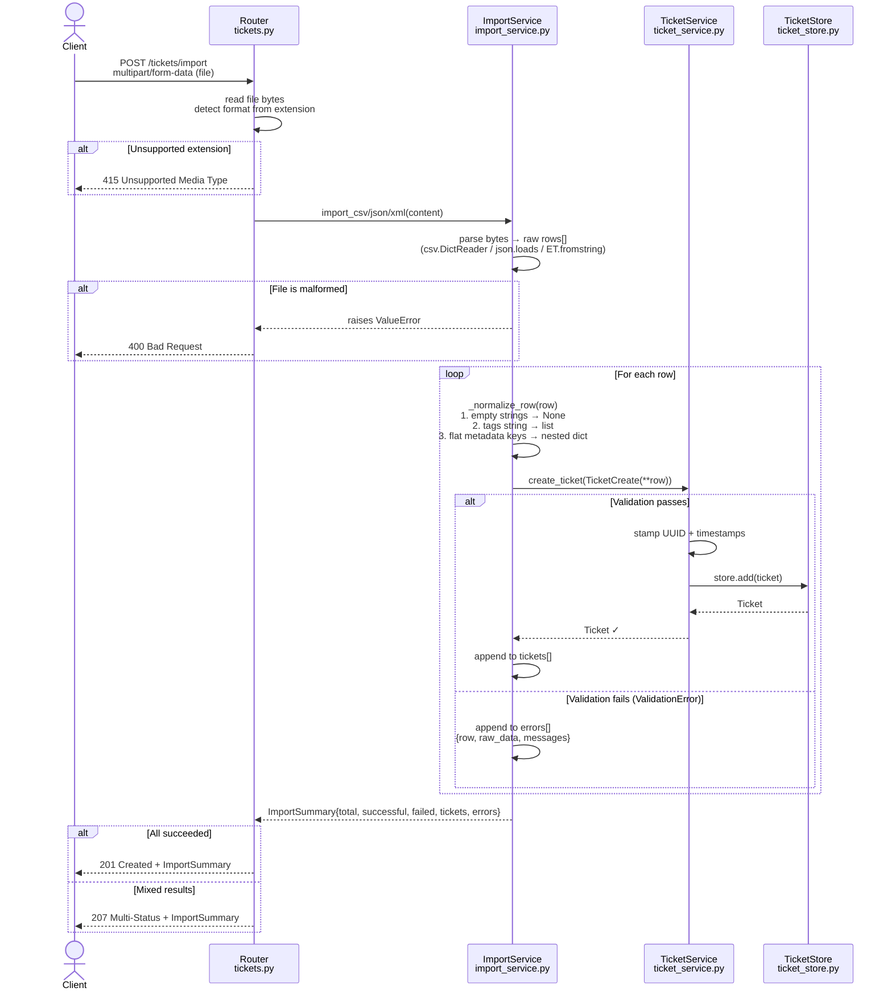
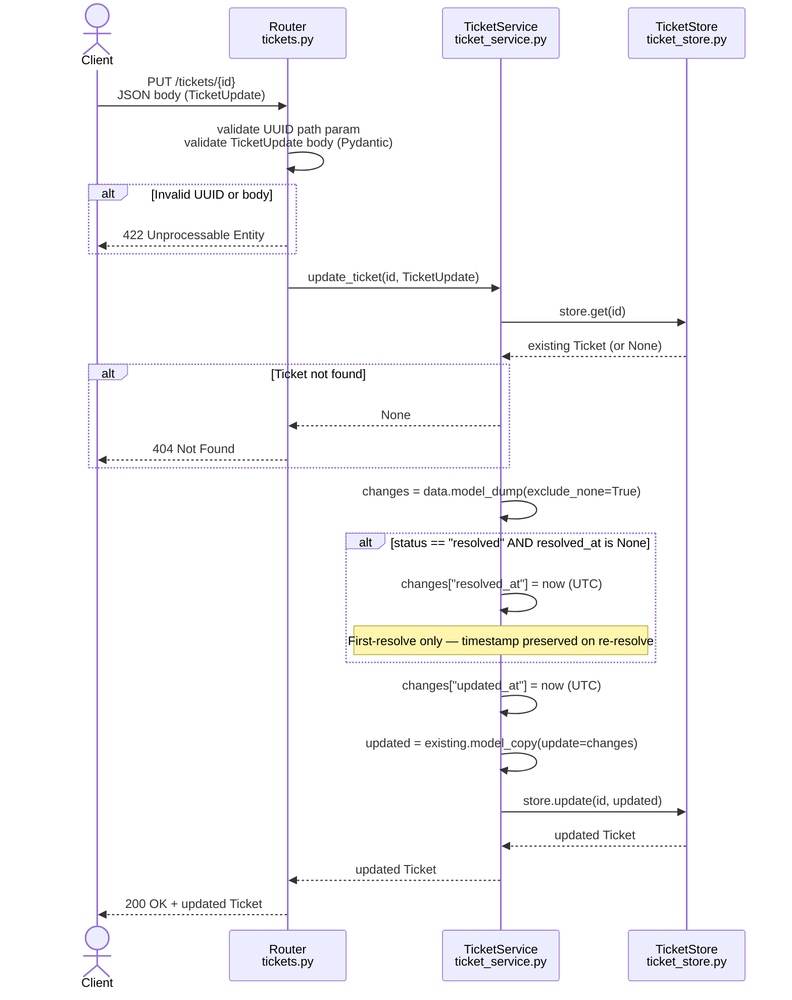
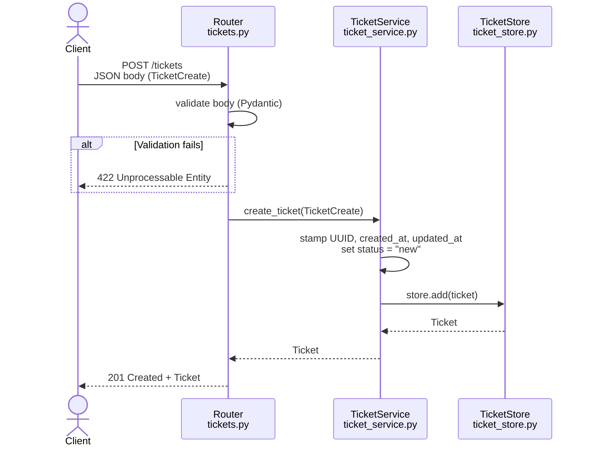

# Data Flow

> Related: [README.md](README.md) · [decisions.md](decisions.md) · [../api/endpoints.md](../api/endpoints.md)

Sequence diagrams for the two most complex flows in Phase 1.

---

## POST /tickets/import — Bulk Import Flow

The import endpoint is the most complex path: it parses a file, normalises each row, validates it, and persists the successes — all while collecting errors for the failures.

---

## PUT /tickets/{id} — Ticket Update Flow

Demonstrates the partial-update pattern and the `resolved_at` auto-stamp behaviour.

---

## POST /tickets — Simple Create Flow

Included for completeness — the straightforward path.

