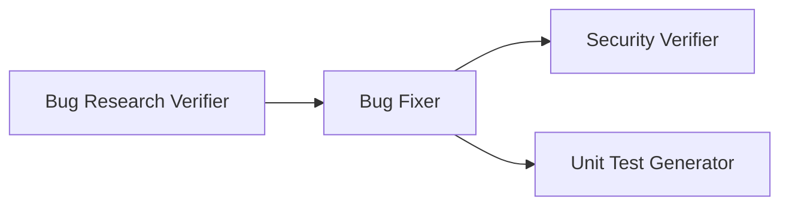

# Homework 4 — 4-Agent Bug Remediation Pipeline

> **Student Name:** Artem Saienko
> **Homework:** HW-4 — Multi-Agent System
> **AI Tools Used:** Claude Code (Claude Opus 4.8, Claude Sonnet 5, Claude Haiku 4.5)

---

## Overview

This homework builds a **4-agent pipeline** that fact-checks bug research, applies a fix
plan, audits the result for security regressions, and generates unit tests — all against a
small, deliberately-buggy Python CLI (`SecureVault`, in `src/`).



The pipeline picks up where a Bug Researcher and Bug Planner already left off:
`research/codebase-research.md` and `implementation-plan.md` are the (pre-existing, committed)
inputs. `./run-pipeline.sh` runs the remaining four required agents in order with a single
command — no manual per-agent invocation.

## Repository layout

```
homework-4/
├── README.md                        # this file
├── run-pipeline.sh                  # single-command pipeline entry point
├── agents/
│   ├── research-verifier.agent.md   # Task 1
│   ├── bug-fixer.agent.md           # Task 2
│   ├── security-verifier.agent.md   # Task 3
│   └── unit-test-generator.agent.md # Task 4
├── skills/
│   ├── research-quality-measurement.md  # Task 1.2
│   └── unit-tests-FIRST.md              # Task 4.2
├── context/bugs/SECUREVAULT-001/bug-context.md   # seeded bug/vuln description
├── research/
│   ├── codebase-research.md         # Bug Researcher output (input)
│   └── verified-research.md         # Bug Research Verifier output
├── implementation-plan.md           # Bug Planner output (input)
├── fix-summary.md                   # Bug Fixer output
├── security-report.md               # Security Verifier output
├── test-report.md                   # Unit Test Generator output
├── src/                             # SecureVault app (vault.py, crypto.py)
├── tests/                           # pytest suite (baseline + generated tests)
│   ├── test_vault.py                 # baseline + Bug 1/Bug 2 regression tests
│   └── test_crypto.py                # generated tests for the crypto.py security fix
└── docs/
    ├── pipeline-logs/               # raw per-stage output from the last run
    └── screenshots/                 # pipeline run screenshots
```

---

## The sample application: SecureVault

`src/` contains a small local CLI password manager (`init` / `add` / `list` / `update`
subcommands) storing Fernet-encrypted credentials in `vault.json`. It's the concrete target
the pipeline operates on — see `context/bugs/SECUREVAULT-001/bug-context.md` for the full
seeded-issue writeup. It shipped with:

- **Bug 1** — `cmd_list` raised `NameError` on a search with zero matches, and only ever
  returned the last match when there were several (`src/vault.py`).
- **Bug 2** — `cmd_update` overwrote each entry with a brand-new two-field dict, silently
  discarding `username` and `created_at` on every password rotation (`src/vault.py`).
- **Security issue** — `src/crypto.py` fell back to a hardcoded encryption key when
  `VAULT_KEY` was unset, and logged raw plaintext passwords/ciphertext to an unrotated
  `vault_debug.log` on any crypto error.

All three issues are fixed (see `fix-summary.md`). The security issue was deliberately left out
of the *first* `implementation-plan.md` pass so the Security Verifier would have something real
to find on the changed code path — it flagged the hardcoded key as **HIGH** and the plaintext
logging as **MEDIUM**. The plan was then updated with a Task 3 targeting `src/crypto.py`
specifically for that remediation, and a second pipeline run applied and re-verified the fix
(see [Last pipeline run](#last-pipeline-run--results) below).

---

## How to run

### Run the app directly

```bash
cd homework-4
pip install cryptography pytest
export VAULT_KEY=$(python3 -c "from cryptography.fernet import Fernet; print(Fernet.generate_key().decode())")

python3 src/vault.py init
python3 src/vault.py add --service github --user alice --password secret1
python3 src/vault.py list --search github
python3 src/vault.py update --service github --password rotated
```

### Run the tests

```bash
export VAULT_KEY=$(python3 -c "from cryptography.fernet import Fernet; print(Fernet.generate_key().decode())")
pytest tests/ -v
```

### Run the full agent pipeline (single command)

```bash
cd homework-4
./run-pipeline.sh
```

This requires the `claude` CLI on `PATH` and API access. For each stage it:

1. Reads the corresponding `agents/*.agent.md` file's YAML frontmatter (`model:`, `tools:`)
   and passes them straight to a non-interactive `claude -p` session.
2. Passes the agent's instruction body as the session's system prompt. Each agent's own
   first instructed step is to `Read` the skill file it needs
   (`skills/research-quality-measurement.md` or `skills/unit-tests-FIRST.md`) — so skills load
   automatically as part of the agent running, with no separate script step.
3. Gates on the stage's expected output file actually existing before moving to the next
   stage, and saves full stage output under `docs/pipeline-logs/`.
4. Generates an ephemeral `VAULT_KEY` for the run if one isn't already exported, since the
   Bug Fixer and Unit Test Generator both execute `pytest`.

Order matches `TASKS.md`: **Bug Research Verifier → Bug Fixer → Security Verifier → Unit Test
Generator.** (Bug Researcher and Bug Planner ran ahead of time; their outputs —
`research/codebase-research.md` and `implementation-plan.md` — are committed inputs, not part
of this script.)

The pipeline never runs `git commit` itself — `implementation-plan.md` intentionally has no
commit steps, since commits for this repo are made manually.

---

## Agents and model choice

| Agent | File | Model | Why this model |
|---|---|---|---|
| Bug Research Verifier | `agents/research-verifier.agent.md` | `claude-opus-4-8` | Fact-checking every `file:line` claim and judging discrepancy severity is a careful, high-stakes reasoning task — a bad verification here misdirects every downstream agent. Worth the strongest reasoning tier. |
| Bug Fixer | `agents/bug-fixer.agent.md` | `claude-haiku-4-5-20251001` | The implementation plan already hands it literal before/after code per task — execution is mechanical (apply the diff, run the test command, stop on failure). A fast/cheap model is sufficient and keeps the routine part of the pipeline cheap. |
| Security Verifier | `agents/security-verifier.agent.md` | `claude-opus-4-8` | Same reasoning tier as the research verifier: distinguishing a real, reachable vulnerability from a look-alike pattern requires tracing actual data flow, not keyword matching. False positives and false negatives are both costly here. |
| Unit Test Generator | `agents/unit-test-generator.agent.md` | `claude-sonnet-5` | Needs more judgment than the Bug Fixer (choosing meaningful boundary cases, satisfying FIRST) but is a well-scoped, mid-complexity task — a mid-tier model balances quality and cost. |

## Skills

- **`skills/research-quality-measurement.md`** (Task 1.2) — defines 4 verification dimensions
  (Location Accuracy, Snippet Fidelity, Root Cause Correctness, Completeness), a 3-tier
  discrepancy severity scale (Blocking / Major / Minor), and 4 quality levels (VERIFIED →
  FAILED VERIFICATION). The Research Verifier must compute the level mechanically from
  discrepancy counts, not eyeball it.
- **`skills/unit-tests-FIRST.md`** (Task 4.2) — defines **F**ast, **I**ndependent,
  **R**epeatable, **S**elf-validating, **T**imely with a concrete checklist. The Unit Test
  Generator must satisfy all five for every test it writes, or explicitly flag a violation
  instead of shipping it silently.

---

## Last pipeline run — results

The pipeline ran twice. **Run 1** fixed Bug 1 and Bug 2 in `src/vault.py` and left
`src/crypto.py` untouched by design, so the Security Verifier had a real, reachable
vulnerability to find. Its `security-report.md` came back **HIGH** (hardcoded fallback key)
and **MEDIUM** (plaintext secrets logged on error). `implementation-plan.md` was then updated
with a Task 3 targeting `src/crypto.py`, and **Run 2** applied and re-verified that fix. The
results below are from Run 2 — the current state of the repo.

- **`research/verified-research.md`** — Result: **FAILED VERIFICATION**. This is an expected
  artifact of re-running against a stale input, not a live problem: `research/codebase-research.md`
  still describes Bug 1 and Bug 2 as present, but both were already fixed by Run 1, so the
  Research Verifier correctly flagged the two bug claims as Blocking (the described broken code
  no longer exists — the file now matches the document's own "Fix Required" snippets). The
  security section's facts still held (hardcoded key + plaintext logging were real at the time
  `codebase-research.md` was written), only its line numbers had drifted (Minor/Major, same as
  Run 1). Net effect: the *code* is correct; the *original research document* is now outdated
  and would need a fresh Bug Researcher pass if used again.
- **`fix-summary.md`** — Task 3 applied: `src/crypto.py`'s `get_key()` no longer falls back to
  a hardcoded key — it raises `ValueError` when `VAULT_KEY` is unset. Both `encrypt()` and
  `decrypt()` error handlers now log only `type(exc).__name__`, never the raw
  plaintext/ciphertext. (Bugs 1 and 2 in `src/vault.py`, from Run 1, remain fixed.)
- **`security-report.md`** — Re-scanned the live code and confirmed all three remediations are
  correct: **0 CRITICAL / 0 HIGH / 0 MEDIUM** (both prior findings are gone), **1 LOW**
  (debug log written to a relative, default-permission path — hygiene only, no secrets in it
  anymore), **1 INFO** (key sourced from an env var — standard, noted for awareness). Report
  only, no code changed.
- **`test-report.md`** — Added `tests/test_crypto.py` with 6 new tests for the Task 3 fix
  (missing `VAULT_KEY` raises; encrypt/decrypt error logs contain no secret material). Combined
  with the 19 tests from Run 1 (`tests/test_vault.py`), full suite: **25 passed, 0 failed.**

```bash
$ pytest tests/ -q
.........................                                              [100%]
25 passed in 4.86s
```

---

## Screenshots

`docs/screenshots/` (terminal captures, content taken directly from real command output/reports):

| File | Shows |
|---|---|
| `01-pipeline-run.png` | `./run-pipeline.sh` running all 4 agent stages in order, with model/tools per stage and the final output summary. |
| `02-bug-fixes.png` | Before/after diffs of `src/vault.py` (Bug 1, Bug 2) and `src/crypto.py` (Task 3 security remediation), plus `fix-summary.md`'s Overall Status. |
| `03-security-scan.png` | `security-report.md` in full: 0 CRITICAL/HIGH/MEDIUM, 1 LOW/1 INFO, ruled-out items, and the prior run's HIGH/MEDIUM findings marked resolved. |
| `04-unit-tests.png` | `pytest tests/ -v` — all 25 tests passing (19 from Run 1 + 6 new from Task 3). |